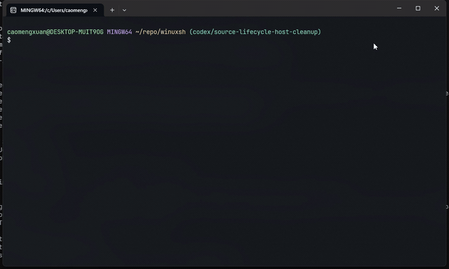

# Why Niubash

The long version of the pitch. The README sells it in five seconds; this page
shows the receipts.

## The Windows shell civil war

Every Windows developer knows the tabs open on their machine:

| Option | The fine print |
|---|---|
| **CMD** | Frozen in 1987. Your company's docs still paste it. |
| **PowerShell** | A genuinely powerful automation language. It is not Bash — your `for` loops, `grep`, and quoting instincts die on arrival. |
| **WSL** | A whole Linux distribution as a hobby you didn't sign up for. Boot a VM to print a directory. Dock your Docker Desktop's memory. Greet `/mnt/c/Users/you/...`. |
| **Git Bash / MSYS2** | Brilliant emulation with a cost: it translates, mangles, and converts your paths at the worst possible moments, and every `git` pays an emulation tax. |

### The treaty

Niubash is one native Windows binary that runs Bash syntax on Windows paths
with real Windows programs — and brings the Unix commands Windows never had
(`ls`, `cat`, `grep`, `find`, `test`, `printf`, ...).

| | Niubash | WSL | Git Bash | PowerShell |
|---|---|---|---|---|
| Bash syntax | ✅ | ✅ | ✅ | ❌ |
| Native Windows paths (`C:\...`, no `/mnt/c`) | ✅ | ❌ | ⚠️ conversion quirks | ✅ |
| Calls `git.exe` / `node.exe` directly | ✅ | ⚠️ via `/mnt/c` | ⚠️ path translation | ✅ |
| Unix commands (`ls`, `grep`, `find`) | ✅ | ✅ | ✅ | ❌ |
| Cold start to prompt | **~170 ms** | seconds | ~1 s | ~280 ms |
| No extra OS, no VM | ✅ | ❌ | ✅ | ✅ |
| Themes, git prompt, plugins | ✅ | — | ✅ | ⚠️ |

One binary. One process. No distro to patch, no emulation layer to appease.

## PowerShell eats arguments

Windows itself is the root cause: the platform has no argv array. Every
executable receives a single command-line string and parses it with its own
rules — and PowerShell adds a second parser on top. That's how
[PowerShell/PowerShell#1995](https://github.com/PowerShell/PowerShell/issues/1995)
("Arguments for external executables aren't correctly escaped") became a
household name, and how
[dotnet/runtime#23347](https://github.com/dotnet/runtime/issues/23347) opens
by citing "the ongoing quoting woes PowerShell experiences."

Same command line, two shells. Watch what actually reaches the process:

```text
# PowerShell 5.1                                # Niubash
> node -e "console.log(JSON.stringify(          ❯ node -e "console.log(JSON.stringify(
    process.argv.slice(1)))" "a b" "" "c\"d"      process.argv.slice(1)))" "a b" "" "c\"d"
    "e\f" "---"                                   "e\f" "---"

ParserError: TerminatorExpectedAtEndOfString   ["a b","","c\"d","e\\f","---"]
```

That command is written the way any model trained on Bash would write it.
PowerShell throws a parse error before the process even starts. And when you
quote it PowerShell's own way, the damage is quieter but still real: five
arguments in, two mangled ones out — the empty string vanishes, the embedded
quote is flattened, the last two arguments fuse into one:

```text
> node -e "console.log(JSON.stringify(process.argv.slice(1)))" "a b" "" 'c"d' "e\f" "---"
["a b","cd e\\f ---"]
```

### Agent casualties, with receipts

For humans this is a nuisance. For AI agents it's a minefield: models are
trained on Bash, their quoting instincts are Bash-shaped, and on a
PowerShell machine every generated command is a roll of the dice.

- [anthropics/claude-code#65162](https://github.com/anthropics/claude-code/issues/65162) — agent used a PowerShell here-string (`@'...'@`) inside the Bash tool; the git commit message was silently corrupted, and `git commit` still exited 0.
- [anthropics/claude-code#83243](https://github.com/anthropics/claude-code/issues/83243) — trivial commands fail with `unexpected EOF` on Windows when PowerShell is the primary shell.
- [anthropics/claude-code#76490](https://github.com/anthropics/claude-code/issues/76490) — Bash allow-list rules never match Windows drive-letter paths; every run re-prompts.
- [openai/codex#31548](https://github.com/openai/codex/issues/31548) — Windows users are voting to make the Codex agent shell configurable; it is locked to PowerShell today.
- [openai/codex#35995](https://github.com/openai/codex/issues/35995) — Python works in the interactive shell but silently disappears inside Codex task execution.
- [openai/codex#33891](https://github.com/openai/codex/issues/33891) / [openai/codex#36560](https://github.com/openai/codex/issues/36560) — the ChatGPT desktop app flashes PowerShell windows while its agent works.
- [microsoft/vscode-python-debugger#233](https://github.com/microsoft/vscode-python-debugger/issues/233) — a space in a path yields incorrectly quoted debug commands.

## The path philosophy: native in, native out

If your mental model says every Unix-flavored shell on Windows must contain
a path-translation layer — because every one you've met so far did — that
is the model running on precedent, not a fact about this product. In
niubash, **the Windows-native path is the first-class citizen**: not the
target of a conversion, but the representation the shell actually thinks
in.

Windows-native binaries don't speak the MSYS dialect. Here is Git Bash,
in the wild, failing at exactly the things Niubash does without thinking:



What just happened, command by command:

| Command | In Git Bash (MSYS) | In Niubash |
|---|---|---|
| `node -e "..." "C:\Users\you\repo"` | the backslashes are eaten — the argument vanishes | argument arrives byte-for-byte |
| `cmd /c dir /c/Windows/...` | `cmd.exe` rejects the MSYS path (exit 1) | native path, native tools, no guessing |
| `git grep "/fn main"` | MSYS rewrites `/fn` into a Windows path — the pattern silently dies | `/` is just a character, not a path to convert |

### The escape hatches are the confession

MSYS "solves" paths by guessing: it heuristically rewrites `/c/foo` into
`C:\foo`, and famously mangles innocent arguments along the way — the
notorious case of `git grep "/pattern"` silently becoming
`git grep "C:\...\pattern"`. A heuristic that always guesses right does not
exist, which is precisely why Git for Windows ships `MSYS_NO_PATHCONV` and
MSYS2 ships `MSYS2_ARG_CONV_EXCL`: an off switch for path conversion is a
documented admission that the conversion layer breaks real commands. Under
MSYS, every native tool call is a game of path roulette, and the house
provides the abort switch next to the wheel.

Niubash has no such switch, because there is no such layer. The
Windows-native path is not a format niubash converts *into* — it is the
shell's internal representation. POSIX-style (`/c/...`, `/usr/bin`),
WSL-style (`/mnt/c/...`), and Windows-style (`C:\...`) are input spellings
that all resolve to that one native reality:

```text
❯ cd /c/Users/you/repo     # MSYS-style input: understood
C:/Users/you/repo            # output: always Windows-native
❯ node -e "console.log(process.cwd())"
C:\Users\you\repo            # native binaries get native cwd
❯ cd "C:\Program Files"     # Windows-style input: understood
❯ pwd
C:/Program Files
```

Input in any dialect. Output always native. One representation, zero
guessing, nothing to disable — for your fingers, and for your agent.

## The verdict

Every incumbent made a bet with the tools of its decade: CMD froze,
PowerShell bet on a brand-new language, WSL bet on virtualization, and
MSYS2/Cygwin bet on emulation. For the actual problem — *running Bash on
Windows, next to native Windows programs* — three of those bets pay out
nothing, and the fourth is structurally guaranteed to leak: translating
between two path worlds is a guessing game, and guesswork embedded in
infrastructure surfaces at the worst possible moment. The escape hatches
(`MSYS_NO_PATHCONV`, `MSYS2_ARG_CONV_EXCL`) are the incumbents' own
documentation of that fact.

The correct architecture is not a better emulator. It is no emulator: a
native implementation where the Windows path is the only representation
that exists, where Bash is implemented as a language — and proven against
GNU Bash's own test suite, 86/86 — and where native programs are called as
what they are: native. That is what niubash ships, and it is why the
emulation stack's failure modes are not "reduced" here. They are
categorically absent.

Emulation was the previous century's approximation of this architecture.
Niubash is the architecture.
